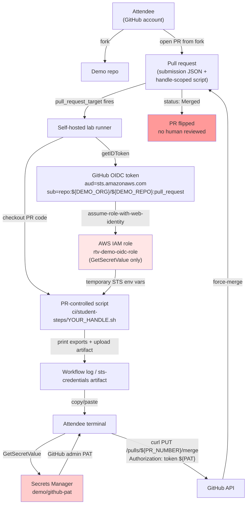
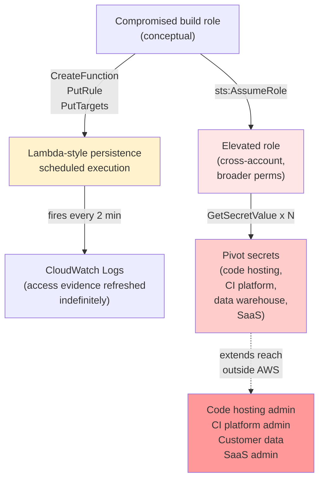
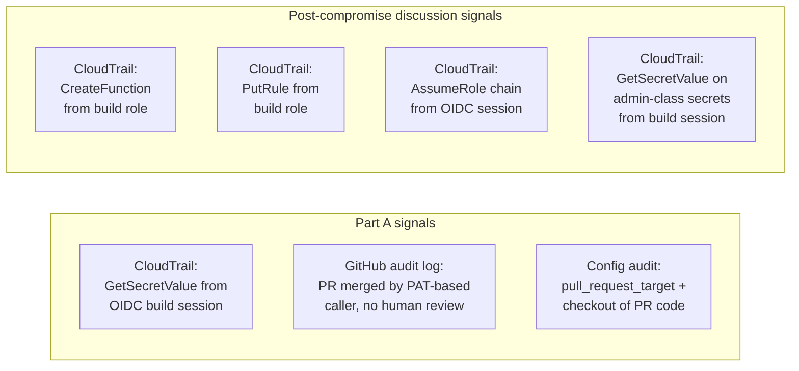

# Architecture Diagrams

## Part A: Attendee hands-on flow

Key points:
- The trusted target workflow constructs `ci/student-steps/YOUR_HANDLE.sh`
  from the submission handle and executes that PR-controlled script.
- The IAM role has exactly one permission. Zero blast radius outside the
  single PAT pull.
- The force-merge call uses a credential that did not exist when the PR was
  opened.

## Post-compromise discussion flow (presenter implementation not published)

Key points:
- Persistence is built from native AWS services. No external infrastructure.
- IAM trust chain abuse turns a scoped role into a broad one via a single
  AssumeRole call.
- Secrets Manager is where "AWS compromise" becomes "enterprise compromise."

## Detection signal placement

All of these are deployable against logs every AWS-using organization already
collects. The gap is not data availability; it is that nobody is writing the
rules.
