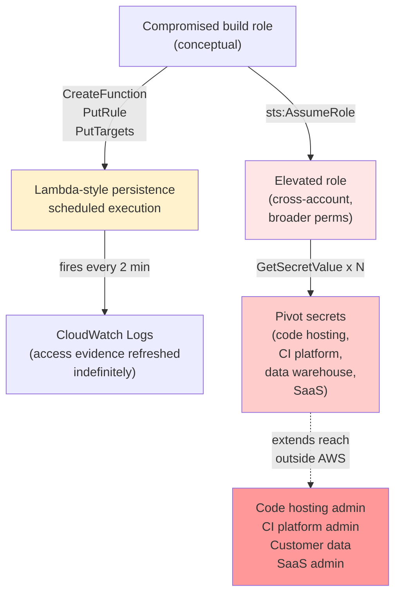
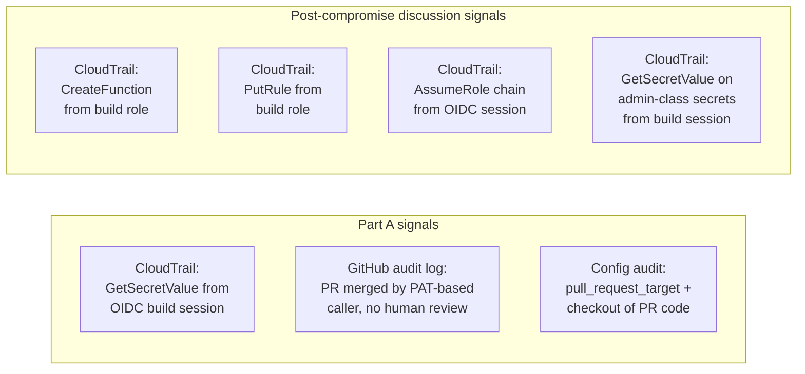

# Architecture Diagrams

## Part A: Attendee hands-on flow

```mermaid
flowchart TD
    A["Attendee<br/>(GitHub account)"] -->|fork| B[Demo repo]
    A -->|open PR from fork| C[Pull request<br/>(status: Open)]
    C -->|pull_request_target fires| D[Self-hosted lab runner]
    D -->|getIDToken| E["GitHub OIDC token<br/>aud=sts.amazonaws.com<br/>sub=repo:ORG/REPO:pull_request"]
    E -->|assume-role-with-web-identity| F["AWS IAM role<br/>rtv-demo-oidc-role<br/>(GetSecretValue only)"]
    F -->|STS credentials| G["Workflow log<br/>(PUBLIC)"]
    G -->|copy/paste| H[Attendee terminal]
    H -->|GetSecretValue| I["Secrets Manager<br/>demo/github-pat"]
    I -->|sets RTV_PAT| H
    H -->|"curl PUT /pulls/N/merge<br/>Authorization: token ${RTV_PAT}"| J[GitHub API]
    J -->|force-merge| C
    C -->|"status: Merged"| K["PR flipped<br/>no human reviewed"]

    style F fill:#ffe6e6
    style I fill:#ffcccc
    style K fill:#ff9999
```

Key points:
- The STS credentials never leave the public workflow log and the attendee's
  laptop. No C2, no exfil endpoint.
- The IAM role has exactly one permission. Zero blast radius outside the
  single PAT pull.
- The force-merge call uses a credential that did not exist when the PR was
  opened.

## Post-compromise discussion flow (presenter implementation not published)



Key points:
- Persistence is built from native AWS services. No external infrastructure.
- IAM trust chain abuse turns a scoped role into a broad one via a single
  AssumeRole call.
- Secrets Manager is where "AWS compromise" becomes "enterprise compromise."

## Detection signal placement



All of these are deployable against logs every AWS-using organization already
collects. The gap is not data availability; it is that nobody is writing the
rules.
